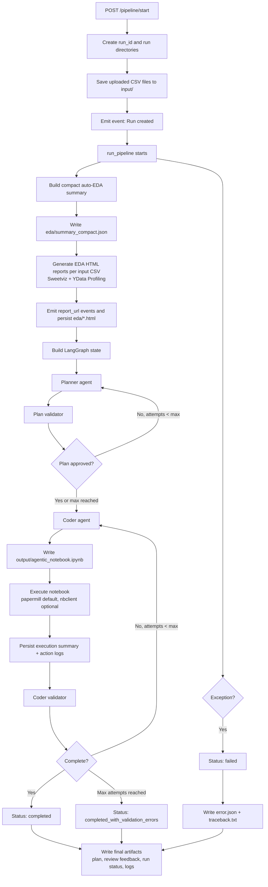

# Data Science Agent/MCP Service

The folllowing is the implementation of an agentic workflow designed to execute data science tasks.

Specifically the agent is designed to complete a series of steps such as: 

    - EDA
    - Data Cleaning
    - Feature Engineering
    - Model Training
    - Model Validation
    - PCA 

As a standard data scientist might do. 

## Workflow Process

The following diagram provides a high level overview of the workflow implemented within this repository.

## Skills 

Taking after anthropic's new skills concept, this was designed with a similar idea in mind. Providing md files that outline specific library usage. Currently only added for the use of the py-autoclean library, such a skill base could be expanded to contain core machine learning concepts. For example, the addition of how to apply a bayesian predictor etc. 

## Output 

The result of this workflow is the output of a re-producable jupyter notebook as well as auto-generated EDA Reports. 

It completes this process using an orchistrator, coder, validator pattern. 

## MCP Integration

This project now exposes an MCP server so external agents can call the workflow by sending instructions and CSV files, then receiving notebook artifacts.

### MCP Endpoint

- Streamable HTTP MCP endpoint: `/mcp`
- Full URL in local docker compose setup: `http://localhost:8001/mcp`

### MCP Tools Implemented

1) `generate_notebook_from_csvs`
- Inputs:
    - `instructions` (string)
    - `csv_files` (array of objects with `filename`, `content_base64`)
    - `ml_prompt` (optional string)
    - `system_prompt` (optional string)
    - `timeout_seconds` (optional int)
    - `prefer_executed_notebook` (optional bool)
- Behavior:
    - Creates a new run
    - Decodes and stores input CSV files
    - Executes the full planner/validator/coder pipeline
    - Returns run metadata plus notebook artifact as base64

2) `get_run_status`
- Inputs:
    - `run_id` (string)
- Behavior:
    - Returns current status, input/output/report files, timestamps, and error fields

### Design Notes

- Uses MCP Python SDK `FastMCP` with Streamable HTTP transport.
- Mounted into existing FastAPI app via `app.mount("/mcp", mcp.streamable_http_app())`.
- Reuses the same internal `run_pipeline(...)` orchestration path as the REST API.
- Returns notebook content in base64 to support direct client-side file reconstruction.